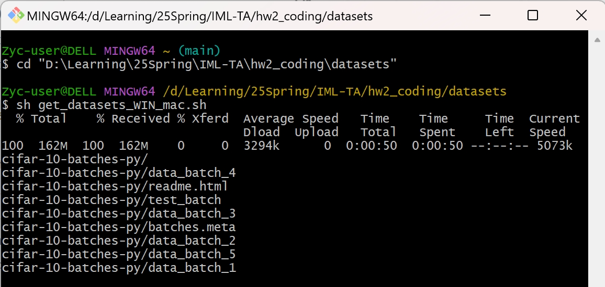

# This is the coding part of HW2

## **Step 0: Download cifar-10 dataset.**

Due to the large memory occupied by the original dataset files, the external dataset source files are not provided in `hw2_coding.zip`. Here are a few options for downloading the CIFAR10 dataset for different OS user groups.

### Windows/MacOS users:

1. Ensure that ***Git*** is installed on your computer. If it isn't, we recommend using the [Git - Downloads](https://git-scm.com/downloads) link to obtain it. This installation is not only beneficial for this homework but will also prove useful in future courses and projects.
2. Open the `datasets` folder.
3. Open `Git Bash` and go to the `datasets` folder with `cd _YOUR_FILE_PATH_ `command.
4. Use `sh get_datasets_WIN_mac.sh` command to run your shell script then you'll download the datasets successfully after waiting for a few seconds.
   

### Ubuntu users:

1. `cd` to the `datasets` file folder
2. Use `sh get_datasets_Ubuntu.sh` command in Terminal.
   

### Common way:

When you open any of the shell scripts in `./datasets` folder, you will easily find the website download url from which we downloaded the datasets. You can freely download the datasets use the url you found, but please make sure the data files are unpacked into the `./datasets/cifar-10-batchs-py` folder.

## Step 1: Following the instruction in `hw2_coding.ipynb` to complete this assignment.

## Step 2: Export the jupyter notebook as PDF and select all pages to the correspondence problem on gradescope `hw2_coding` part. Note that the `coding` part and the `writing` part share the same deadline and grace days.

## **Note:**

1. May you have any difficulties in setting up environment, please refer to `setup.md`
2. If you have any trouble doing your homework, feel free to contact TAs on Piazza.
