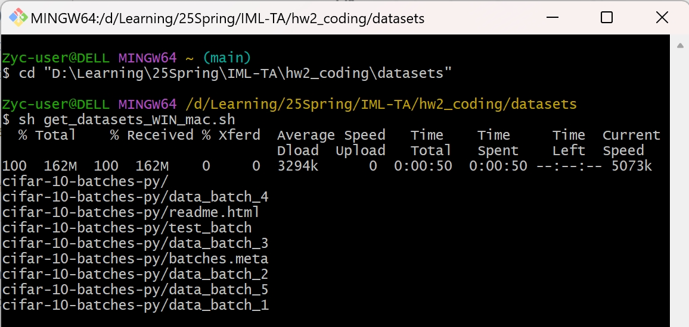

# CS182 HW3

## Introduction

HW3 consists of two parts: writing exercises and coding exercises.

### Part One: Writing

1. Finish the problems in `writing/hw3.pdf`.
2. Upload your answers as "yourname_hw3_writing.pdf" to Gradescope.

### Part Two: Coding

1. Finish `coding/svm.ipynb`.
2. Please export the jupyter notebook as a PDF named  "yourname_hw3_coding.pdf" and upload it to Gradescope.


# Here are the details for the coding part of HW3

## **Step 0: Download cifar-10 dataset.**

Due to the large memory occupied by the original dataset files, the external dataset source files are not provided in `hw3/coding`. Here are a few options for downloading the CIFAR10 dataset for different OS user groups.

### Windows/MacOS users:

1. Ensure that ***Git*** is installed on your computer. If it isn't, we recommend using the [Git - Downloads](https://git-scm.com/downloads) link to obtain it. This installation is not only beneficial for this homework but will also prove useful in future courses and projects.
2. Open the `datasets` folder.
    3. Open `Git Bash` and go to the `datasets` folder with `cd _YOUR_FILE_PATH_ `command.
4. Use `sh get_datasets_WIN_mac.sh` command to run your shell script then you'll download the datasets successfully after waiting for a few seconds.


### Ubuntu users:

1. `cd` to the `datasets` file folder
2. Use `sh get_datasets_Ubuntu.sh` command in Terminal.


### Common way:

When you open any of the shell scripts in `./datasets` folder, you will easily find the website download url from which we downloaded the datasets. You can freely download the datasets use the url you found, but please make sure the data files are unpacked into the `./datasets/cifar-10-batchs-py` folder.

### Setup Environment

To simplify the management of various computing environments and avoid package version conflicts, we highly recommend using Anaconda, which allows for easy creation, management, and switching between Python environments. If you choose not to use a virtual environment, it is up to you to make sure that all dependencies for the code are installed globally on your machine.

### **Make sure that you have installed Anaconda:**

If you decide to work locally, we recommend using the free [Anaconda Python distribution](https://www.anaconda.com/download/), which provides an easy way for you to handle package dependencies. Please be sure to download the Python 3 version. We are no longer supporting Python 2.

### **Anaconda Virtual environment:**

Once you have Anaconda installed, it makes sense to create a virtual environment for the course.To set up a virtual environment, run (in a terminal)

`conda create -n CS182 python=3.10 anaconda`

to create an environment called `CS182`.

Then, to activate and enter the environment, run

`conda activate CS182`

To exit, you can simply close the window, or run

`conda deactivate CS182`

Note that every time you want to work on the assignment, you should run `source activate CS182` (change to the name of your virtual env).

You may refer to [this page](https://conda.io/docs/user-guide/tasks/manage-environments.html) for more detailed instructions on managing virtual environments with Anaconda.

### **Step 2: Install packages**

```bash
pip install ./coding/requirements.txt
```

## Step 1: Following the instruction in `hw3_coding.ipynb` to complete this assignment.

## Step 2: Export the jupyter notebook as PDF and select all pages to the correspondence problem on gradescope `hw3_coding` part. Note that the `coding` part and the `writing` part share the same deadline and grace days.

## **Note:**

If you have any trouble doing your homework, feel free to contact TAs on Piazza.