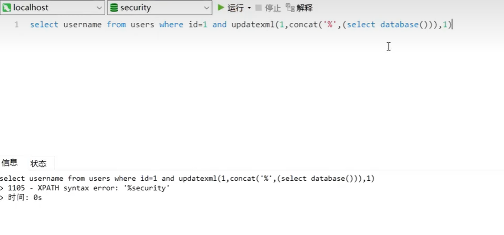

# sql:

1. SELECT * FROM "table name";

也可以SELECT label1,lbel2 ...

can add "LIMIT 5" only display 5 lines（limit 0,2【1到2行】）

WHERE label=“information”(**LIKE**  "%" %represent 0 or more any string,and **_** only represent one string)  only display the label satisfying those requirments. It also can  compare: label>80 **AND** label<80||BETWEEN 80 AND 90. 

(we can replace = with <>, and will get the opposite answer)

ORDER BY label(seqentially)（也可以写写数字，第几列）

We can also use it as a function:

进行display，排序，选择操作

- 联合查询：union select能帮助查询下面的执行语句，就是执行多次select

- 

2. AVG

And use it with GROUP BY

If not following the sequence will report error

3. COUNT

ignore blank line and with **(DISTINCT label)**, 

4. DISTINCT

5. create tables

   

   primary key ensure that no repetition

   DROP TABLE clubs(不要这个表格)

6. INSERT INTO table

   VALUES(....,.....)correspond to the table created

7. UPDATE （如果只是某一个数据，要制定内容）

   

8. DELETE

   

9. 表格连接：

   

   这里还显示了没有社团的同学，如果不想要这些的话把LEFT改成INNER、

   

10. 注释符号

    /**/或者单行--

# SQL注入

注入常用函数（Mysql）

（1）user() 返回当前使用数据库的用户，也就是网站配置文件中连接数据库的账号 （2）version() 返回当前数据库的版本 （3）database() 返回当前使用的数据库，只有在use命令选择一个数据库之后，才能查到 （4）group_concat() 把数据库中的某列数据或某几列数据合并为一个字符串 （5）@@datadir 数据库路径 （6）@@version_compile_os 操作系统版本

。

SQL注入重点关注的表：

利用语句查询：

字符型注入：

但凡‘’内部找到了前面的label就不会对后者进行逻辑判断

数字型注入：

会执行运算和逻辑判断

## 联合查询注入：

- 

3.判断字段数用order by，是否发生异常

4.回显位置：多输入的联合查询帮助判断字段的拿些位置会在页面中显示。

这里有三个字段，由联合查询判断回显位置是2,3字段

查看显示列：

堆叠注入：

但是有的时候发现用联合注入没办法获取到信息（按理来说第五关会有5列，应该能够在id=-1的情况下输出union要求的内容，也就是不能显示回显位置)

## 报错盲注：

没办法告诉报错，

通过特殊函数错误使用使其产生错误结果来获取信息。、

通过函数后面的错误参数产生报错返回数据库里的信息。

因为显示字符有限，所以后面再加where排除已经显示出来的名字

也可以这样，用mid函数截取子字符串：

把查询语句写在灰色部分。

## 布尔盲注：

逐个试每一位的字符。

字符串截取：

1. substr（str，pos，len）

2. mid（）

3. right（）从又开始截取多少位，外面再使用ascii码select  ascii（）/ord()【可以通过二分查找解决】

4. trim（）：

   

5. between

6. in：  select 1 in 

7. 异或：

   不允许使用注释符号。因为一个数^自身=0 一个数^0=1

id=1'^(...)^ '1'

## 延时盲注

## 